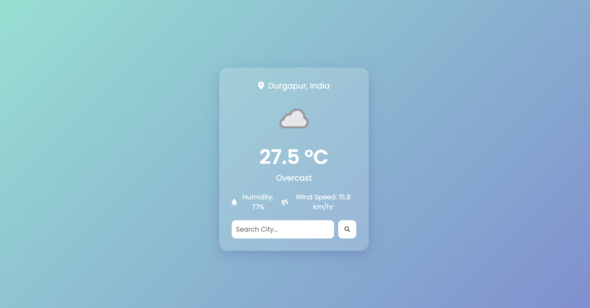

# 🌤️ Weather App

A simple and beautiful weather app built using **HTML**, **CSS**, and **JavaScript**.  
It shows real-time weather data based on the city entered by the user.

## 🔍 Features

- 🌍 Get current weather info by city name
- 🌡️ Display temperature, weather condition, and icons
- 🌧️ Dynamic weather icons
- 📱 Responsive design

## 📸 Screenshot



> *(You can replace the image URL above with your own screenshot link once deployed)*

## 🚀 Demo

👉 [Live Demo on GitHub Pages](https://your-username.github.io/weather-app/)

## 🛠️ Technologies Used

- HTML5
- CSS3
- JavaScript (Fetch API)
- [WeatherAPI.com](https://www.weatherapi.com/) for weather data
- [Font Awesome](https://fontawesome.com/) for icons

## 🧪 How to Run

1. Clone the repository:
   ```bash
   git clone https://github.com/your-username/weather-app.git


Built with ❤️ by DeepDevelopers